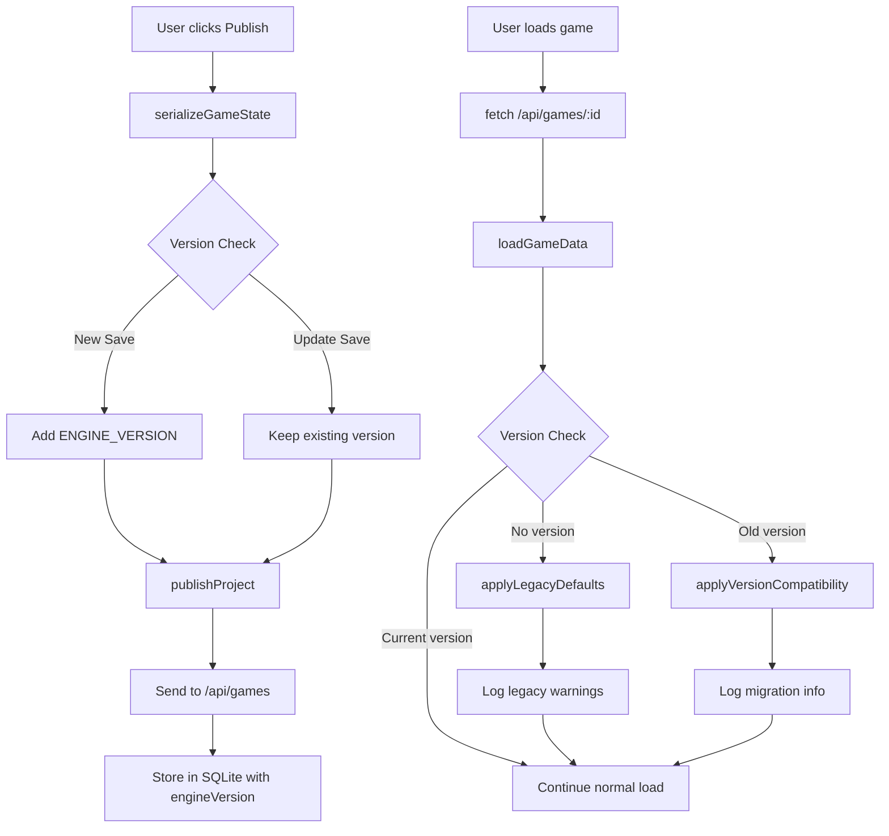

# Engine Versioning Implementation Plan for RoGold

## Overview
This document outlines the implementation plan for adding a robust engine versioning system to RoGold. The versioning system will enable:
- Tracking which engine version created/edited a game
- Detecting legacy games and applying compatibility layers
- Asset cache busting based on engine version
- Safe defaults for missing data in old games

## Current State Analysis

### Files to Modify
1. **`rogold/version.js`** (new) - Centralized version constants
2. **`rogold/studio.js`** - Save/publish logic (lines 3368-4073)
3. **`rogold/game.js`** - Load/compatibility logic (lines 3752+)
4. **`rogold/database.js`** - Data schema for version storage

### Current Save/Load Flow
- **Save**: `saveProject()` → `serializeGameState()` → `publishProject()` → `/api/games`
- **Load**: `loadGameData()` parses JSON and creates game objects
- **Version Field**: Currently hardcoded as `'1.0'` in `serializeGameState()` (line 3434)

---

## Implementation Steps

### Step 1: Create Version Constants File
**File**: `rogold/version.js`

```javascript
// Engine Versioning System
// Semantic versioning: MAJOR.MINOR.PATCH

// Current engine version
export const ENGINE_VERSION = '1.0.0';

// Minimum supported version for compatibility
export const MINIMUM_COMPATIBLE_VERSION = '1.0.0';

// Version history for migration reference
export const VERSION_HISTORY = {
    '1.0.0': {
        releaseDate: '2024-01-01',
        features: ['Initial engine release', 'Basic part physics', 'Lua scripting'],
        migration: null
    },
    '1.1.0': {
        releaseDate: '2024-03-15',
        features: ['Enhanced physics', 'New asset loading'],
        migration: null
    }
};

// Cache busting parameter for assets
export const getCacheBustParam = () => `v=${ENGINE_VERSION}`;
```

### Step 2: Update Studio Save Logic
**File**: `rogold/studio.js`

#### 2.1 Import Version Constants
Add at top of file:
```javascript
import { ENGINE_VERSION, getCacheBustParam } from './version.js';
```

#### 2.2 Modify `serializeGameState()` (line 3397)
```javascript
function serializeGameState() {
    // ... existing code ...

    return {
        scripts: scripts,
        objects: serializedObjects,
        settings: JSON.parse(localStorage.getItem('rogold_studio_settings') || '{}'),
        timestamp: new Date().toISOString(),
        // Replace hardcoded version with ENGINE_VERSION
        engineVersion: ENGINE_VERSION,
        gameVersion: '1.0' // User-settable game version
    };
}
```

#### 2.3 Modify `publishProject()` (line 4000)
```javascript
async function publishProject() {
    // ... existing code ...

    const projectData = {
        title: gameTitle,
        description: gameDescription,
        ...gameData,  // Now includes engineVersion
        published: true,
        gameId: 'game_' + Date.now(),
        thumbnail: customThumbnail || autoThumbnail,
        creator_id: currentUser,
        engineVersion: ENGINE_VERSION  // Explicitly set
    };

    // ... rest unchanged ...
}
```

### Step 3: Update Game Load Logic
**File**: `rogold/game.js`

#### 3.1 Import Version Constants
Add at top of file:
```javascript
import { ENGINE_VERSION, MINIMUM_COMPATIBLE_VERSION, getCacheBustParam, VERSION_HISTORY } from './version.js';
```

#### 3.2 Modify `loadGameData()` (line 3752)
```javascript
async function loadGameData(data, isPublished = false) {
    console.log('Loading game data:', data);

    // === VERSION CHECKING ===
    const gameEngineVersion = data.engineVersion || 'unknown';
    
    // Check for legacy games (no version or older version)
    if (!data.engineVersion) {
        console.warn(`[VERSION] Legacy game detected (no version field). Applying compatibility defaults.`);
        data = applyLegacyDefaults(data);
    } else if (isVersionOlder(data.engineVersion, ENGINE_VERSION)) {
        console.warn(`[VERSION] Game from older engine (${data.engineVersion} < ${ENGINE_VERSION}). Applying compatibility layer.`);
        data = applyVersionCompatibility(data, data.engineVersion, ENGINE_VERSION);
    }

    // === ASSET CACHE BUSTING ===
    const cacheBust = getCacheBustParam();
    // Apply cache busting to asset URLs if needed

    // ... existing loading logic ...
}
```

### Step 4: Implement Compatibility Layer
**File**: `rogold/game.js` or new `rogold/compatibility.js`

```javascript
// Compatibility utilities
export function isVersionOlder(versionA, versionB) {
    const a = versionA.split('.').map(Number);
    const b = versionB.split('.').map(Number);
    for (let i = 0; i < 3; i++) {
        if (a[i] < b[i]) return true;
        if (a[i] > b[i]) return false;
    }
    return false;
}

export function applyLegacyDefaults(data) {
    // Safe defaults for games without version field
    return {
        ...data,
        settings: {
            gravity: -196.2,
            friction: 0.4,
            restitution: 0.05,
            ...data.settings
        },
        // Apply legacy physics defaults
        objects: Object.fromEntries(
            Object.entries(data.objects || {}).map(([name, obj]) => [
                name,
                {
                    ...obj,
                    Anchored: obj.Anchored !== false,
                    CanCollide: obj.CanCollide !== false,
                    Transparency: obj.Transparency || 0
                }
            ])
        )
    };
}

export function applyVersionCompatibility(data, fromVersion, toVersion) {
    const migrated = { ...data };

    // Example: Migration from 1.0.0 to 1.1.0
    if (isVersionOlder(fromVersion, '1.1.0') && !isVersionOlder('1.1.0', toVersion)) {
        // Apply 1.1.0 compatibility changes
        migrated.objects = Object.fromEntries(
            Object.entries(migrated.objects || {}).map(([name, obj]) => [
                name,
                {
                    ...obj,
                    // New default properties added in 1.1.0
                    Mass: obj.Mass || 1,
                    Friction: obj.Friction || 0.4,
                    Restitution: obj.Restitution || 0.05
                }
            ])
        );
    }

    console.log(`[VERSION] Migrated game from ${fromVersion} to ${toVersion}`);
    return migrated;
}
```

### Step 5: Asset Cache Busting
**File**: `rogold/game.js` and `rogold/studio.js`

#### 5.1 Create Asset Cache Helper
```javascript
// Cache busting for assets
export function bustAssetUrl(url) {
    if (!url) return url;
    const separator = url.includes('?') ? '&' : '?';
    return `${url}${separator}${getCacheBustParam()}`;
}
```

#### 5.2 Apply to GLTFLoader in Studio and Game
```javascript
// Example usage in GLTFLoader
const loader = new GLTFLoader();
loader.load(bustAssetUrl(assetUrl), (gltf) => {
    // ...
});
```

### Step 6: Legacy Game Warnings
**File**: `rogold/game.js`

```javascript
function logLegacyGameWarnings(data) {
    const version = data.engineVersion || 'unknown';
    
    console.group(`[VERSION] Loading game from engine version: ${version}`);
    
    if (!data.engineVersion) {
        console.warn('⚠️  This game was created with an unknown/old engine version');
        console.warn('⚠️  Some features may not work correctly');
        console.warn('💡 Consider re-saving this game in the latest RoGold Studio');
    } else if (isVersionOlder(version, '1.0.0')) {
        console.warn('⚠️  This game was created with a very old engine version');
        console.warn('⚠️  Physics behavior may differ from original');
    }
    
    console.groupEnd();
}
```

### Step 7: Update Database Schema
**File**: `rogold/database.js`

The database already stores game data as JSON, so the `engineVersion` will be stored in the `data` JSON field. No schema changes needed.

---

## Data Flow Diagram



---

## Version Comparison Logic

```javascript
// Compare two semantic versions
// Returns: -1 if a < b, 0 if equal, 1 if a > b
function compareVersions(a, b) {
    const parse = v => v.split('.').map(Number);
    const [majorA, minorA, patchA] = parse(a);
    const [majorB, minorB, patchB] = parse(b);
    
    if (majorA !== majorB) return majorA - majorB;
    if (minorA !== minorB) return minorA - minorB;
    return patchA - patchB;
}

// Usage examples
compareVersions('1.0.0', '1.1.0')  // -1 (older)
compareVersions('1.1.0', '1.0.0')  // 1 (newer)
compareVersions('1.0.0', '1.0.0') // 0 (equal)
```

---

## Testing Plan

### Test Cases

1. **New Game Publishing**
   - [ ] Verify ENGINE_VERSION is embedded in published game data
   - [ ] Verify version appears in database

2. **Loading Current Version Games**
   - [ ] Verify no warnings are logged
   - [ ] Verify game loads correctly

3. **Loading Legacy Games (no version)**
   - [ ] Verify warning is logged
   - [ ] Verify applyLegacyDefaults applies safe defaults
   - [ ] Verify game loads with expected behavior

4. **Loading Future Games (hypothetical)**
   - [ ] Handle gracefully with warnings
   - [ ] Log that game may use newer features

5. **Asset Cache Busting**
   - [ ] Verify URLs include version parameter
   - [ ] Verify different versions get different cache keys

---

## Files to Create/Modify Summary

| File | Action | Lines |
|------|--------|-------|
| `rogold/version.js` | Create | All |
| `rogold/studio.js` | Modify | 1 (import), 3434 (version), 4027-4035 (publish) |
| `rogold/game.js` | Modify | 1 (import), 3752+ (load logic) |
| `rogold/compatibility.js` | Create | Optional - can inline in game.js |

---

## Migration Considerations

### Backward Compatibility
- All existing games without `engineVersion` will be treated as legacy
- Safe defaults ensure they continue to work

### Forward Compatibility
- Future engine versions can read current games
- Migration functions will be added as needed

### Database
- No schema changes needed
- Version stored in existing `data` JSON column

---

## Rollback Plan

If issues arise:
1. Remove `version.js` imports from studio.js and game.js
- Revert `serializeGameState()` to use hardcoded `'1.0'`
- Compatibility functions can remain for future use
